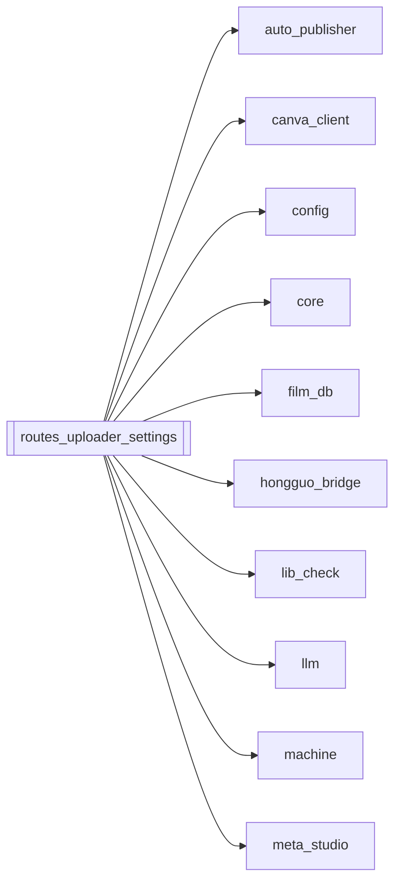

# `routes_uploader_settings`

[← Index](../generated/module-index.md) · [Brain home](../README.md)

<!-- AUTO:START — sinh bởi scripts/brain_build.py 2026-11-17 19:05. Đừng sửa tay khối này. -->
**File:** `routes_uploader_settings.py` · **Lớp:** `control` · **611 dòng** (495 code) · **23 hàm**, **0 class** · sha1 `e80ad7a71b`

> routes_uploader_settings.py — API Router cho Quản lý Cài đặt (Settings) & YouTube Uploader. Tích hợp trực tiếp vào Pineline V4 Server (:8804): 1. Settings:

### Phụ thuộc

- **Gọi tới (import nội bộ):** [auto_publisher](./auto_publisher.md), [canva_client](./canva_client.md), [config](./config.md), [core](./core.md), [film_db](./film_db.md), [hongguo_bridge](./hongguo_bridge.md), [lib_check](./lib_check.md), [llm](./llm.md), [machine](./machine.md), [meta_studio](./meta_studio.md)
- **Được dùng bởi:** —
- **Được nhắc tên file `.py` (subprocess/script) bởi:** [restart_server](./restart_server.md)
- **Test:** ❌ chưa có test import trực tiếp
- **Thư viện ngoài:** `fastapi`, `psutil`

```mermaid
flowchart LR
  routes_uploader_settings[[routes_uploader_settings]]
  routes_uploader_settings --> auto_publisher[auto_publisher]
  routes_uploader_settings --> canva_client[canva_client]
  routes_uploader_settings --> config[config]
  routes_uploader_settings --> core[core]
  routes_uploader_settings --> film_db[film_db]
  routes_uploader_settings --> hongguo_bridge[hongguo_bridge]
  routes_uploader_settings --> lib_check[lib_check]
  routes_uploader_settings --> llm[llm]
  routes_uploader_settings --> machine[machine]
  routes_uploader_settings --> meta_studio[meta_studio]
```

### API routes (31)

| Method | Path | Handler | Dòng |
|---|---|---|---:|
| GET | `/api/auto-publish/config` | `auto_publish_get_config` | 439 |
| POST | `/api/auto-publish/config` | `auto_publish_save_config` | 446 |
| POST | `/api/auto-publish/scan` | `auto_publish_scan` | 468 |
| GET | `/api/auto-publish/state` | `auto_publish_status` | 480 |
| GET | `/api/auto-publish/status` | `auto_publish_status` | 480 |
| POST | `/api/auto-publish/trigger` | `auto_publish_trigger` | 454 |
| GET | `/api/canva/auth-url` | `canva_auth_url` | 504 |
| GET | `/api/canva/callback` | `canva_callback` | 515 |
| POST | `/api/canva/config` | `canva_save_config` | 543 |
| POST | `/api/canva/create` | `canva_create` | 555 |
| GET | `/api/canva/status` | `canva_status` | 491 |
| GET | `/api/settings` | `get_all_settings` | 51 |
| POST | `/api/settings` | `update_settings` | 111 |
| POST | `/api/settings/test-llm` | `test_llm_conn` | 194 |
| POST | `/api/settings/test-telegram` | `test_telegram_msg` | 158 |
| POST | `/api/uploader/clear-done` | `clear_done_uploads` | 402 |
| POST | `/api/uploader/enqueue` | `enqueue_upload` | 333 |
| POST | `/api/uploader/launch` | `launch_yt_uploader_process` | 412 |
| POST | `/api/uploader/remove` | `remove_upload_item` | 380 |
| GET | `/api/uploader/status` | `get_uploader_status` | 297 |
| GET | `/auto-publish/config` | `auto_publish_get_config` | 439 |
| POST | `/auto-publish/config` | `auto_publish_save_config` | 446 |
| POST | `/auto-publish/scan` | `auto_publish_scan` | 468 |
| GET | `/auto-publish/state` | `auto_publish_status` | 480 |
| GET | `/auto-publish/status` | `auto_publish_status` | 480 |
| POST | `/auto-publish/trigger` | `auto_publish_trigger` | 454 |
| GET | `/canva/auth-url` | `canva_auth_url` | 504 |
| GET | `/canva/callback` | `canva_callback` | 515 |
| POST | `/canva/config` | `canva_save_config` | 543 |
| POST | `/canva/create` | `canva_create` | 555 |
| GET | `/canva/status` | `canva_status` | 491 |

### Hàm & class top-level

| Tên | Dòng | Dài | Tham số | Docstring |
|---|---:|---:|---|---|
| `get_all_settings` | 51 | 57 | `` | Lấy toàn bộ cấu hình hiện tại của Pineline V4. |
| `update_settings` | 111 | 44 | `payload` | Lưu cài đặt mới vào pineline.config.json và đồng bộ biến môi trường. |
| `test_telegram_msg` | 158 | 33 | `payload` | Thử gửi 1 tin nhắn test đến Telegram để kiểm tra bot token và chat ID. |
| `test_llm_conn` | 194 | 38 | `payload` | Thử gửi 1 prompt nhỏ đến LLM để đo độ trễ và kiểm tra model. |
| `_is_yt_uploader_running` | 238 | 16 | `` | Kiểm tra xem tiến trình yt_uploader.py có đang chạy không. |
| `_read_upload_history` | 256 | 17 | `limit` | Đọc lịch sử upload từ Z:\yt_uploader\upload_history.jsonl. |
| `_read_upload_queue` | 275 | 9 | `` | Đọc hàng đợi upload từ Z:\yt_uploader\queue_state.json. |
| `_write_upload_queue` | 286 | 8 | `items` | Ghi an toàn vào Z:\yt_uploader\queue_state.json. |
| `get_uploader_status` | 297 | 33 | `` | Lấy trạng thái tổng thể của YouTube Uploader. |
| `enqueue_upload` | 333 | 44 | `payload` | Thêm một hoặc nhiều video vào hàng chờ upload của yt_uploader. |
| `remove_upload_item` | 380 | 19 | `payload` | Xóa một item khỏi hàng chờ upload. |
| `clear_done_uploads` | 402 | 7 | `` | Xóa tất cả các video đã hoàn thành (xong/lỗi) khỏi hàng chờ. |
| `launch_yt_uploader_process` | 412 | 19 | `` | Khởi động tiến trình yt_uploader.py chạy nền nếu đang tắt. |
| `auto_publish_get_config` | 439 | 3 | `` |  |
| `auto_publish_save_config` | 446 | 4 | `body` |  |
| `auto_publish_trigger` | 454 | 10 | `body` |  |
| `auto_publish_scan` | 468 | 6 | `` |  |
| `auto_publish_status` | 480 | 3 | `` |  |
| `canva_status` | 491 | 9 | `` |  |
| `canva_auth_url` | 504 | 7 | `` |  |
| `canva_callback` | 515 | 24 | `code, state` |  |
| `canva_save_config` | 543 | 8 | `body` |  |
| `canva_create` | 555 | 56 | `body` |  |

### Config / env keys (20)

`AGENT_API_KEY`, `AGENT_BASE_URL`, `AGENT_FALLBACK_MODEL`, `AGENT_MODEL`, `AGENT_TELEGRAM`, `LIBRARY_DIR`, `LLM_API_KEY`, `LLM_BASE_URL`, `LLM_MODEL`, `OMNI_MODEL`, `RENDER_ENCODER`, `REVIEW_MODEL`, `TELEGRAM_ALLOWED_USERS`, `TELEGRAM_BOT_TOKEN`, `TEMP`, `TRANSLATE_MODEL`, `VIENEU_BATCH`, `VIENEU_DEVICE`, `WORK_DIR`, `YT_UPLOADER_DIR`

**Cổng nhắc tới:** 8083

**File/artifact nhắc tới:** `queue_state.json`, `settings.json`, `upload_history.jsonl`

**Tín hiệu rủi ro (đếm tĩnh):** broad_except=18 · file_writes=1 · sleep=1 · subprocess=1 · swallow_except=8

### Lịch sử (từ docs/)

- **Fix logs (3):**
  - [2026-11-11 — machine-config: cổng/thư mục phụ thuộc máy thành setting (V4 — layout phẳng)](../../fixes/2026-11-11-machine-config.md)
  - [Settings + Uploader API 404 trên :8802; thiếu skip upload](../../fixes/2026-11-07-uploader-settings-8802.md)
  - [Films UI :8802 — onclick/`jq` chết + Settings/Uploader 404](../../fixes/2026-11-07-films-ui-syntax.md)
- **Reviews:** [2026-11-11-v4-v5-port-review](../../reviews/2026-11-11-v4-v5-port-review.md), [2026-11-02-v4-structure-and-v2-port](../../reviews/2026-11-02-v4-structure-and-v2-port.md)
- Nhắc trong CHANGELOG: **2** lần · DECISIONS: **0** lần

<!-- AUTO:END -->

<!-- MANUAL:START -->
## Vai trò (viết tay)

_Chưa viết. 2–4 câu: module này chịu trách nhiệm gì trong pipeline, ai gọi nó, nó KHÔNG làm gì._

## Luồng chính

_Các hàm vào (entry) → bước chính → output/side effect. Ghi tên hàm thật._

## Bất biến & hợp đồng

_Điều luôn phải đúng (vd: chỉ ghi manifest qua `Manifest.update`; 1 job / ghế). Vi phạm = bug._

## Bẫy đã biết

_Lỗi từng gặp + link `docs/fixes/...`. Những chỗ dễ sửa sai._

## Ghi chú vận hành

_Config key quan trọng, cần restart gì khi sửa (:8801 / :8802 / hot-reload), cách test._
<!-- MANUAL:END -->
